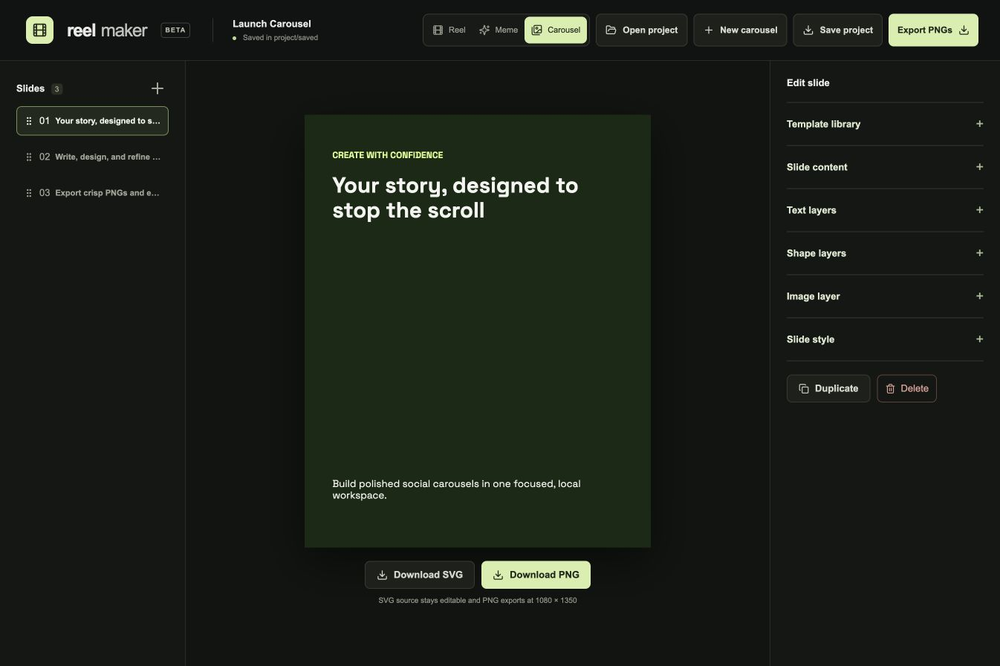

# Reel Maker

A local-first editor for reels, memes, and social carousels. Reel Maker runs on your computer, keeps imported media local, and exports finished assets with native FFmpeg.



Reel Maker brings three creation workflows into one consistent desktop-style workspace:

- **Reel** — assemble clips, voiceovers, music, captions, and color treatments
- **Meme** — combine a background image with video, text, layout, and audio controls
- **Carousel** — design reusable social slides and export editable SVGs or crisp PNGs

## Highlights

- Build multi-shot vertical, square, and landscape reels
- Add voiceovers, music, timed captions, and basic color grading
- Create layered memes with text, audio mixing, masks, and optional local background removal
- Design editable carousel slides and export SVG or PNG files
- Save reusable projects and templates locally
- Use the localhost agent API for assisted workflows

Everything stays local by default: source media, saved projects, templates, rendering, and exports.

## Online demo

The repository includes `wrangler.jsonc` for a Cloudflare Worker Static Assets deployment. The hosted build uses browser storage only—there is no R2 bucket, database, account system, or server-side media upload.

- Carousel creation, templates, SVG/PNG export, and project settings work in the browser.
- Browser-saved projects and templates stay on that device and browser profile.
- Original-clip memes can be clipped with the rectangle mask and exported as WebM entirely in the browser.
- Background removal and native MP4 export require the desktop edition because those workflows use FFmpeg.
- Visitors can open or fork the MIT-licensed source from the editor header.

## WebMCP

Reel Maker progressively exposes browser-native WebMCP tools when opened in a
compatible browser. An agent can create projects, switch editors, update meme
copy and styles, build carousel slides, change carousel themes, inspect the
current project, and save it locally. The tools call the same client-side state
used by the visible editor.

WebMCP does not add an AI service or remote MCP server. It does not upload
media, use Cloudflare storage, or create an API bill. Local file selection and
downloads remain user-controlled browser actions.

WebMCP is experimental. In current Chrome development builds, enable
`chrome://flags/#enable-webmcp-testing`, relaunch Chrome, and inspect the page
with a compatible WebMCP tool inspector. Browsers without WebMCP support use
Reel Maker normally and do not load a polyfill.

In Cloudflare Workers Builds, connect this GitHub repository and use:

```text
Build command: npm run build:cloudflare
Deploy command: npm run deploy
```

No R2 binding or application secrets are required.

## Requirements

- Node.js 20.19+ or Node.js 22+
- FFmpeg and FFprobe available on `PATH`
- macOS, Linux, or Windows for the web editor
- macOS only for the optional native Swift SVG renderer

## Run locally

```sh
npm install
npm run dev
```

Open the URL printed by Vite. The local media engine uses `http://127.0.0.1:4318`.

For a production build:

```sh
npm run build
npm start
```

## Optional background removal

Background removal runs locally using `rembg` and ONNX models:

```sh
npm run setup:meme
```

The initial setup downloads Python dependencies and model files. Imported media and generated outputs remain in the ignored `data/` directory.

## Local data

- Imported media: `data/media/`
- Exports: `data/exports/`
- Saved projects: `saved/`
- Saved templates: `saved/templates/`

Project files reference local media IDs. Back up `saved/` and `data/media/` together when moving work between computers.

## Validation

```sh
npm test
npm run build
```

## Agent API

See [AGENT_API.md](./AGENT_API.md) for localhost automation endpoints and examples.

## Security

Reel Maker is designed as a localhost tool, not a public or multi-user server. Keep the engine bound to `127.0.0.1`. See [SECURITY.md](./SECURITY.md) for reporting guidance.

## Contributing

Contributions are welcome. Read [CONTRIBUTING.md](./CONTRIBUTING.md) before opening a pull request.

## License

MIT. Bundled fonts retain their individual SIL Open Font License notices in `public/fonts/`.
